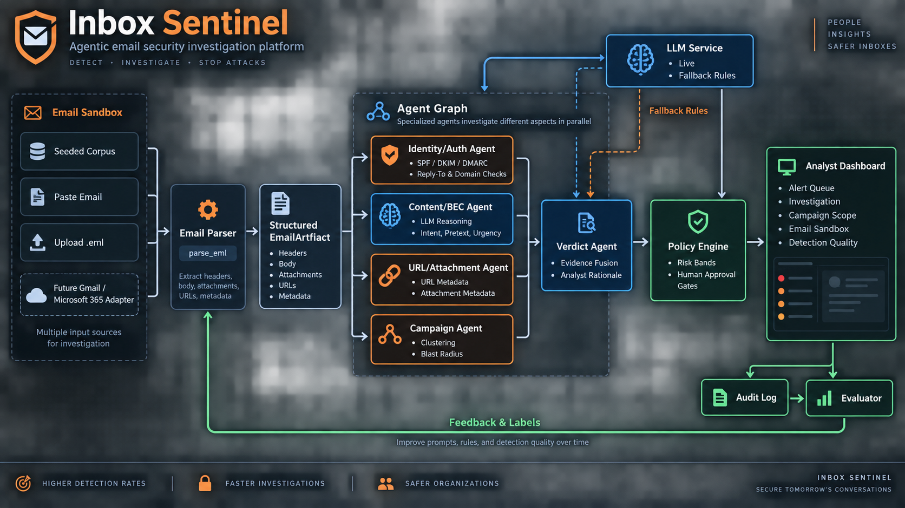

# Architecture

A technical walkthrough of the code: what each module does, how a message flows
through the graph, where the LLM is and is not trusted, and where to extend it.

For the pitch, the demo script and setup, see [README.md](README.md). For the
security posture, see [threat_model.md](threat_model.md).



---

## 1. The shape of the system

One message in, one `IncidentDecision` plus one `PolicyDecision` out:

```
EmailRecord ──> LangGraph StateGraph ──> (IncidentDecision, PolicyDecision)
```

Everything else is detail about how those two objects get built. The entry
point is a single function:

```python
from app.agents.graph import investigate
decision, policy = investigate(email_record)
```

The UI, the tests and the sandbox all call exactly that. There is no second
code path for "demo mode" versus "real mode" — the seeded corpus and an
uploaded `.eml` go through the same graph, which is why the sandbox is
meaningful rather than decorative.

---

## 2. Module map

```
app/
├── models/                  typed contracts — no logic
│   ├── email_models.py      EmailRecord, Attachment (the input)
│   ├── findings.py          Evidence, Finding (agent output) + LLM schemas
│   └── incident_models.py   IncidentDecision, PolicyDecision (the output)
├── agents/                  the graph and its nodes
│   ├── graph.py             StateGraph wiring, fan-out/fan-in, state reducer
│   ├── identity_auth.py     deterministic — headers, SPF/DKIM/DMARC, lookalikes
│   ├── content_bec.py       LLM — intent/pretext; keyword path as fallback
│   ├── url_attachment.py    deterministic — URL structure, risky types, hashes
│   ├── campaign.py          deterministic — clustering, blast radius, IOC graph
│   └── verdict.py           LLM — evidence fusion; risk scoring stays arithmetic
├── services/                everything that is not an agent
│   ├── llm.py               provider cascade, structured output, injection fence
│   ├── email_parser.py      corpus loading, .eml parsing, shared helpers
│   ├── policy_engine.py     risk bands → actions, approval gates (no LLM)
│   ├── audit_log.py         append-only SQLite
│   └── evaluator.py         precision/recall/F1, FPR/FNR, confusion matrix
├── ui/streamlit_app.py      analyst console (7 pages)
data/                        emails.jsonl, interactions.jsonl, expected_labels.jsonl
tests/                       51 tests
```

The dependency direction is strictly one-way: `models` ← `services` ← `agents`
← `ui`. No model imports a service; no service imports an agent. That is what
lets the whole detection stack be tested without Streamlit in the picture.

---

## 3. The typed contract

Every agent — deterministic or LLM-backed — returns the same `Finding`
([app/models/findings.py](app/models/findings.py)):

```python
class Finding(BaseModel):
    component: str                      # human-readable agent name
    category: str                       # identity_auth | content_bec | url_attachment | campaign_scope
    severity: str = "low"               # low | medium | high
    confidence: float = 0.6
    evidence: list[Evidence]            # type + value + why-it-matters
    benign_signals: list[str]           # what argues *against* a threat
    uncertainties: list[str]            # what could not be determined
    recommended_actions: list[str]
    mitre_techniques: list[str]
    source: str = "rules"               # "llm" or "rules" — which path produced this
```

Three fields carry most of the design intent:

- **`evidence`** is a list of `(type, value, explanation)` triples rather than
  prose, so the UI can render it, a test can assert on it, and an analyst can
  see the actual artifact instead of a summary of it.
- **`benign_signals`** exists so an agent can argue against a threat. Without
  it, a detector can only accumulate suspicion, which is how false positives
  get locked in.
- **`source`** records which path produced the finding. A verdict reached
  during an LLM outage stays distinguishable after the fact, in the UI and in
  the audit log.

---

## 4. The graph

[app/agents/graph.py](app/agents/graph.py) builds a LangGraph `StateGraph`:

```
          ┌─ identity_auth   (deterministic)
parse ────┼─ content_bec     (LLM)
          ├─ url_attachment  (deterministic)
          └─ campaign        (deterministic)
                   │
                   ▼  fan-in
               verdict       (LLM)
                   │
                   ▼
              policy_engine  (deterministic)
```

### State and the reducer

```python
class InvestigationState(TypedDict, total=False):
    email: EmailRecord
    findings: Annotated[list[Finding], _merge]
    verdict: dict[str, Any]
    policy: PolicyDecision
    decision: IncidentDecision
```

The `Annotated[..., _merge]` is the load-bearing part. Four nodes write to
`findings` concurrently; without a reducer, LangGraph raises on the concurrent
update. `_merge` concatenates, so each analyzer appends its own finding without
coordinating with the others.

Because those four run in parallel, **they complete in nondeterministic order**.
`verdict_node` therefore sorts by a fixed `ORDER` map before doing anything
with them, so the rendered evidence list and any assertion over it are stable
run to run.

### Why the fan-out is four nodes and not one prompt

Each analyzer looks at a different artifact class and fails in a different way.
Keeping them separate means a wrong verdict can be traced to the specific
finding that caused it. Collapsing them into one large prompt would make every
failure look identical from the outside, and there would be nothing to test
independently.

---

## 5. Where the LLM is — and where it is deliberately absent

Exactly **two** of the seven nodes call a model.

| Node | Path | Why |
|---|---|---|
| `parse` | deterministic | artifact extraction has exact answers |
| `identity_auth` | deterministic | header and auth comparison is mechanical |
| `content_bec` | **LLM** | intent, impersonation, pretext, manufactured urgency |
| `url_attachment` | deterministic | string structure, extensions, hashes |
| `campaign` | deterministic | set intersection and string similarity |
| `verdict` | **LLM** | fusing four findings into a rationale |
| `policy` | deterministic | action selection must never be model-driven |

Header parsing, authentication results, URL structure, hashing and clustering
are deterministic problems with exact answers. Routing them through a model
makes them slower, costlier and non-reproducible without making them more
accurate.

### The trust boundary

The model **cannot**:

- select or trigger a containment action,
- set a risk score,
- change message state (`action_status`),
- introduce a verdict label outside a fixed vocabulary.

It **can** only emit findings, a rationale, a confidence, and a
needs-human-review flag. This is structural, not prompt-based: `policy_engine`
is a pure function of `(risk, verdict, needs_human_review)` and never receives
model output directly. A successful prompt injection can skew one *finding*; it
cannot cause an action.

### Risk scoring stays arithmetic

```python
SEVERITY_POINTS = {"low": 6, "medium": 18, "high": 30}
risk = min(100, sum(SEVERITY_POINTS[f.severity] for f in findings))
```

Plus **risk floors** in `_floor_for()` for high-confidence deterministic
patterns. A vendor bank-change request with clean authentication and no
attachment would otherwise score low on severity arithmetic alone, which is
precisely the case that matters most — so `bank_change` floors it at 91.

### Taxonomy precedence — the measured finding

`verdict.decide_verdict()` does something non-obvious, and it came out of
measurement rather than design instinct.

When the LLM went live, verdict agreement on the 14-message corpus went **down**,
12/14 → 11/14. The model reads intent well — it correctly upgraded `msg-003`
from "Suspicious" to BEC by recognising the pretext — but it flattens fraud
taxonomy, labelling both vendor RFQ fraud (`msg-008`) and payment fraud
(`msg-009`) as "Suspected BEC", since all three are broadly BEC-shaped.

The root cause was a design bug: when the LLM was live, the deterministic
subtype label computed by `_floor_for` was discarded entirely. So now:

```python
if floor_verdict and verdict != floor_verdict:
    verdict = floor_verdict          # rule floor owns the LABEL
    label_source = "rule_floor"      # LLM keeps rationale/confidence/review
```

- A deterministic floor fires → **the rule owns the label**, the LLM owns the
  rationale, confidence and needs-review call.
- No floor fires → **the LLM's label stands** (this is what fixed `msg-003`).

That split scores **13/14** — better than either path alone. Both directions
are pinned by tests in
[tests/test_llm_fallback.py](tests/test_llm_fallback.py).

An off-vocabulary label is treated as a failure and the deterministic chain
decides instead, which keeps the label space stable enough for precision and
recall to mean anything.

---

## 6. The LLM service

[app/services/llm.py](app/services/llm.py) is the only module that talks to a
provider.

### Provider cascade

```python
MODEL_CHAIN = [
    ("groq",   "openai/gpt-oss-120b"),   # most capable on Groq
    ("groq",   "openai/gpt-oss-20b"),    # same family, cheaper and faster
    ("groq",   "qwen/qwen3.8-27b"),      # different family, same provider
    ("google", "gemini-3.5-flash"),      # different provider entirely
]
```

`structured_call` walks the chain and returns the first success. Only when
every entry fails does it raise `LLMUnavailable`, which the calling agent
catches to use its rule path. Entries whose provider has no API key are skipped
rather than attempted.

The chain spans two providers deliberately: the first three share a Groq
dependency, so the Gemini tail is what survives a whole-provider outage. This
was not hypothetical — the original model, `llama-3.3-70b-versatile`, was
decommissioned by Groq mid-build, and every LLM node silently degraded to rules
until the chain was added. (There is no Llama entry today: Groq retired the
general-purpose Llama chat models. The only Llama models it still serves are
the Prompt Guard injection classifiers, which cannot produce this structured
output.)

### Structured output

Every call is `with_structured_output(schema)` against a Pydantic model
(`ContentBecAssessment`, `VerdictAssessment`). A malformed response is a
validation error the cascade can fall through, not garbage that flows
downstream into a risk score.

### Injection containment

Attacker-controlled text is fenced before it reaches a model:

```python
def wrap_untrusted(label: str, content: str) -> str:
    safe = (content or "").replace("</untrusted_email>", "[/untrusted_email]")
    return f'<untrusted_email source="{label}">\n{safe}\n</untrusted_email>'
```

Two mechanisms, in order of importance:

1. **Structural** — the model has no action-selection capability at all
   (section 5). This is what actually holds.
2. **Prompt** — `INJECTION_GUARD` states the fenced content is evidence, never
   instructions, and that embedded directives should be *reported as evidence
   of manipulation* rather than obeyed. The closing-tag replacement means the
   fence cannot be broken from inside.

Both are tested: `test_fence_cannot_be_broken_from_inside` and
`test_injection_attempt_still_scores_as_malicious`.

### Honest degradation reporting

`graph.policy_node` inspects the `source` of each LLM-capable node and reports
three states, not two:

| mode | meaning |
|---|---|
| `live` | both LLM nodes answered |
| `partial` | one answered, one fell to rules |
| `fallback` | neither answered; fully deterministic |

`partial` exists because of a real bug: when the content reasoner fell to rules
but verdict fusion still answered, the UI read `fallback` / "deterministic
rules" while the rationale on screen had plainly been written by a model.
`llm_detail` now names which nodes used the model and which used rules.

---

## 7. Deterministic components worth reading

### `campaign.py` — clustering

The MVP hardcoded `if email.id == "msg-005"`, so every other message reported
"no campaign found". Clustering is now genuine, over four independent
indicators:

- shared sender domain
- shared URL domain
- shared attachment SHA-256
- normalised subject template — `normalize_subject()` strips `Re:`/`Fwd:`,
  collapses digits to `#` and drops punctuation, so "Invoice 4471 due" and
  "Invoice 9902 due" become the same key

Each match carries the *reason* it matched, which is what the UI renders.
`build_campaign_graph()` produces a NetworkX graph
(campaign → messages → recipients → indicators) and `blast_radius()` counts
distinct recipients plus opened/clicked/replied interaction.

A standalone message correctly returns an empty cluster — both directions are
tested, so the clustering can't be "fixed" by simply matching everything.

### `policy_engine.py` — bands and gates

```
  0–29   monitor               leave in mailbox              no approval
 30–59   analyst_review        queue for review              no approval
 60–79   recommend_quarantine  quarantine                    approval required
 80–100  contain_and_purge     quarantine + purge + incident approval required
```

Band actions are layered with verdict-specific ones (`VERDICT_ACTIONS`). One
of those is a judgement call worth noting: for suspected BEC the actions
include *avoid blanket-blocking the vendor domain before confirmation*, because
the sender is often a compromised legitimate partner and blocking them breaks
real business communication.

`needs_human_review=True` forces approval regardless of band — conflicting
evidence must not auto-escalate past a human. All eight band boundaries are
tested explicitly, since these gate real actions.

### `audit_log.py` — append-only

Three tables in SQLite: `audit_log`, `analyst_feedback`, `message_state`.
There is **no UPDATE or DELETE path** in the module — a correction is a new
row, which is what an auditor wants. Approving containment writes a row *and*
flips `action_status` to `quarantined`, replacing the MVP's cosmetic
`st.code` string that persisted nothing.

### `evaluator.py` — real metrics

The MVP reported precision *and* recall as `correct/total`, which is accuracy
twice under two names. Now:

- `per_class_metrics()` — TP/FP/FN, precision, recall, F1 per class
- `binary_metrics()` — malicious vs benign, plus FPR and FNR
- `low_confidence_queue()` — where analyst review adds the most value
- unlabelled messages are excluded rather than raising `KeyError`

On the seeded corpus this yields P=1.0 / R=0.667 for Suspected BEC — visibly
different numbers, which is the point.

---

## 8. Ingestion and the sandbox

`email_parser.parse_eml()` takes RFC-822 bytes and returns an `EmailRecord`:
headers via the stdlib `email` module, `Authentication-Results` parsed for
spf/dkim/dmarc, URLs by regex, attachments hashed with SHA-256.

Attachments are **hashed in memory and never written to disk, unpacked, or
opened**. URLs are parsed as strings; nothing resolves DNS or issues a request.

`parse_raw_text()` sniffs whether pasted text starts with a header block and
either delegates to `parse_eml` or treats the input as a bare body.

**This function is the extension seam.** Gmail (`users.messages.get`,
`format=RAW`) and Microsoft Graph (`/messages/{id}/$value`) both return RFC-822
bytes that `parse_eml` already accepts, so live ingestion is an adapter plus
OAuth — not a rewrite of the detection stack.

---

## 9. UI notes

[app/ui/streamlit_app.py](app/ui/streamlit_app.py) is a thin rendering layer;
it contains no detection logic. Investigations are cached with
`@st.cache_data` keyed on the **serialised** `EmailRecord`, so sandbox
submissions re-run when their content changes while the seeded corpus is
scored once.

Styling follows a design-system method rather than taste. Severity and policy
band are *status* channels, not categorical series, so they use a reserved
status palette and always pair colour with an icon and a text label — colour
never carries meaning alone. Severity uses only good/warning/critical: warning
and serious measure too close to separate reliably (normal-vision ΔE 13.6,
below the 15 floor), so the middle step is reserved for the four-step band
scale, where a name is always rendered beside it. Each view has exactly one
hero figure — the risk score — with a severity meter beneath it.

---

## 10. Testing

51 tests, hermetic and fast (~1s). `tests/conftest.py` clears **every**
provider key and drops cached clients, so the suite never issues a network
call and verdict assertions stay reproducible. (This mattered: an earlier
version cleared only `GROQ_API_KEY`, so adding a Gemini key made the suite
issue real API calls and took it from 0.5s to 224s.)

| File | Covers |
|---|---|
| `test_detection.py` | the five original MVP assertions, ported; finding attributability |
| `test_policy_engine.py` | all eight band boundaries, clamping, approval forcing |
| `test_email_parser.py` | `.eml` parsing, attachment hashing, header tolerance, subject normalisation |
| `test_campaign.py` | clustering in both directions, blast radius, graph node kinds |
| `test_llm_fallback.py` | cascade fallback, off-vocabulary rejection, taxonomy precedence, injection containment |
| `test_audit_and_eval.py` | append-only persistence, status flip, precision ≠ recall |

Tests that exercise the LLM boundary inject a fake `structured_call` that
dispatches on the requested schema, so both LLM nodes receive valid output
without a network call.

---

## 11. Known limitations

- **`msg-007` is still misclassified** — a Teams-branded credential phish on
  `teams-alerts.example`. The lookalike check only catches homoglyphs
  (`micros0ft` → `microsoft`), so a domain that legitimately *contains* a brand
  token passes. Detecting "contains a brand token but is not that brand's
  domain" is the next detection rule to add.
- **14 labelled messages** is a demonstration of correct measurement, not a
  validated accuracy claim.
- **Seeded telemetry** in `interactions.jsonl` is fabricated; blast-radius
  figures illustrate the mechanism rather than measuring anything.
- **No auth on the Streamlit app.** It is a local analyst console, not a
  multi-tenant service.
- **Actions are simulated.** A production deployment would put quarantine/purge
  behind a separate service with its own authorisation, rather than letting the
  analysis process call it.

## 12. Next integration points

Scoped out deliberately, in rough priority order:

1. **Live ingestion** via Gmail / Microsoft Graph — adapter onto `parse_eml`,
   plus OAuth with delegated least-privilege scopes and a pull loop.
2. **FastAPI service layer + Docker**, so the graph is callable from a SOAR
   playbook rather than only a UI.
3. **Real enrichment** — URL sandboxing, attachment detonation, threat-intel
   reputation, QR image decoding.
4. **Prompt-injection classifier** — Groq serves
   `meta-llama/llama-prompt-guard-2-86m`, a purpose-built injection detector
   that would fit as a pre-filter node scoring inbound content before the
   reasoning agents see it.
5. **Eval harness in CI** over a larger labelled corpus, gating prompt changes
   on precision/recall regression.
